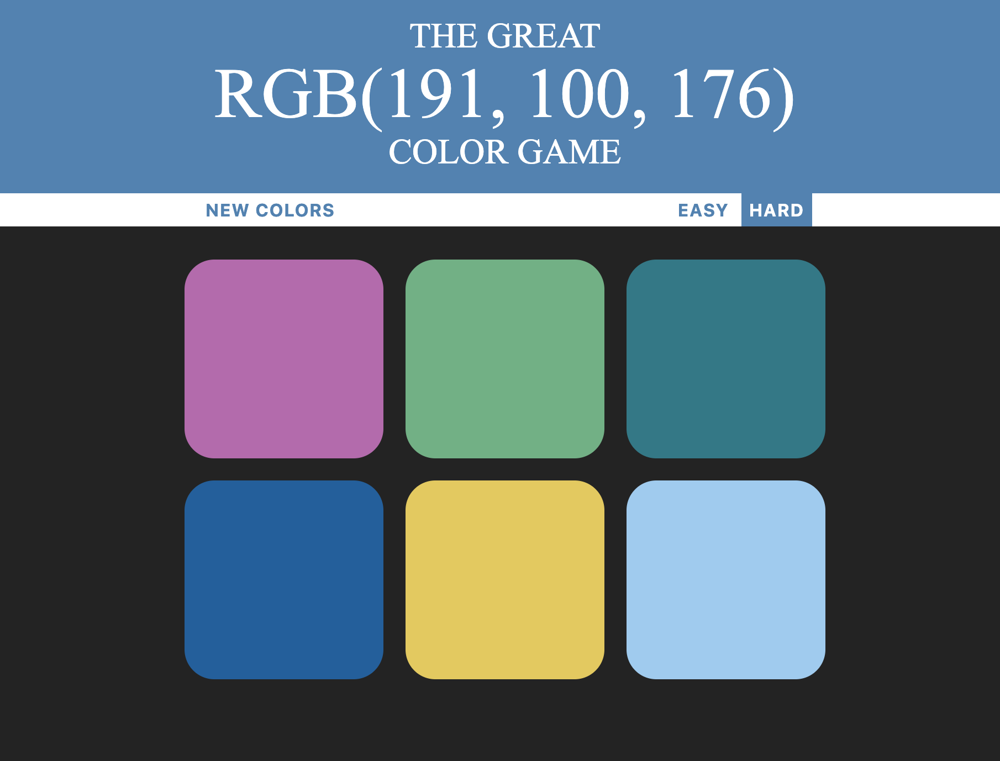

# RGB Color Game

## Summary
A game designed to teach and reinforce RGB color recognition and skills. This program will display a random RGB color and then have you guess which square matches. On hard there are six options, while on easy there are three. 

## Usage
This project helped teach HTML5, CSS, and JavaScript. To run open the HTML file in a web browser.